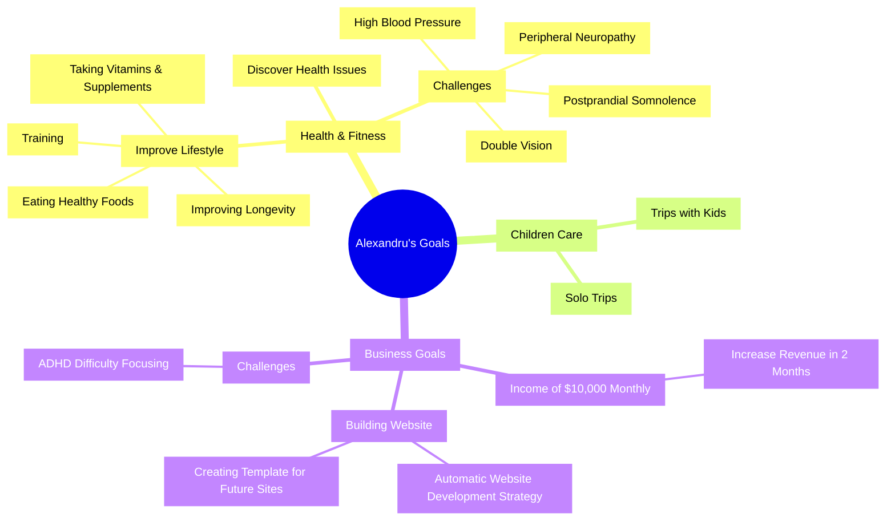

# project-tracking

```mermaid
mindmap
  root((Alexandru's Goals))
    Health[Health & Fitness]
      Discover[Discover Health Issues]
      Lifestyle[Improve Lifestyle]
        Vitamins[Taking Vitamins & Supplements]
        HealthyEating[Eating Healthy Foods]
        Training[Training]
        Longevity[Improving Longevity]
      ChallengesH[Challenges]
        DoubleVision[Double Vision]
        HighBP[High Blood Pressure]
        Neuropathy[Peripheral Neuropathy]
        Somnolence[Postprandial Somnolence]
    Children[Children Care]
      Trips[Trips with Kids]
      SoloTrips[Solo Trips]
    Business[Business Goals]
      Income[Income of $10,000 Monthly]
        IncreaseRevenue[Increase Revenue in 2 Months]
      Website[Building Website]
        Template[Creating Template for Future Sites]
        AutoStrategy[Automatic Website Development Strategy]
      ChallengesB[Challenges]
        ADHD[ADHD Difficulty Focusing]
```
