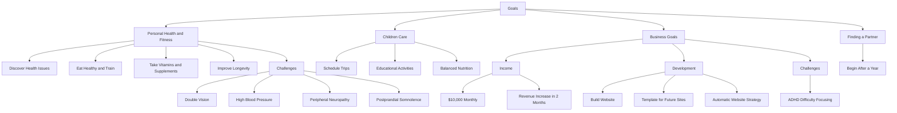

# project-tracking

```mermaid
graph TD;
    A[Goals] --> B[Personal Health and Fitness];
    A --> C[Children Care];
    A --> D[Business Goals];
    A --> E[Finding a Partner];
    B --> B1[Discover Health Issues];
    B --> B2[Eat Healthy and Train];
    B --> B3[Take Vitamins and Supplements];
    B --> B4[Improve Longevity];
    B --> B5[Challenges];
    B5 --> B5A[Double Vision];
    B5 --> B5B[High Blood Pressure];
    B5 --> B5C[Peripheral Neuropathy];
    B5 --> B5D[Postprandial Somnolence];
    C --> C1[Schedule Trips];
    C --> C2[Educational Activities];
    C --> C3[Balanced Nutrition];
    D --> D1[Income];
    D1 --> D1A[$10,000 Monthly];
    D1 --> D1B[Revenue Increase in 2 Months];
    D --> D2[Development];
    D2 --> D2A[Build Website];
    D2 --> D2B[Template for Future Sites];
    D2 --> D2C[Automatic Website Strategy];
    D --> D3[Challenges];
    D3 --> D3A[ADHD Difficulty Focusing];
    E --> E1[Begin After a Year];

```
